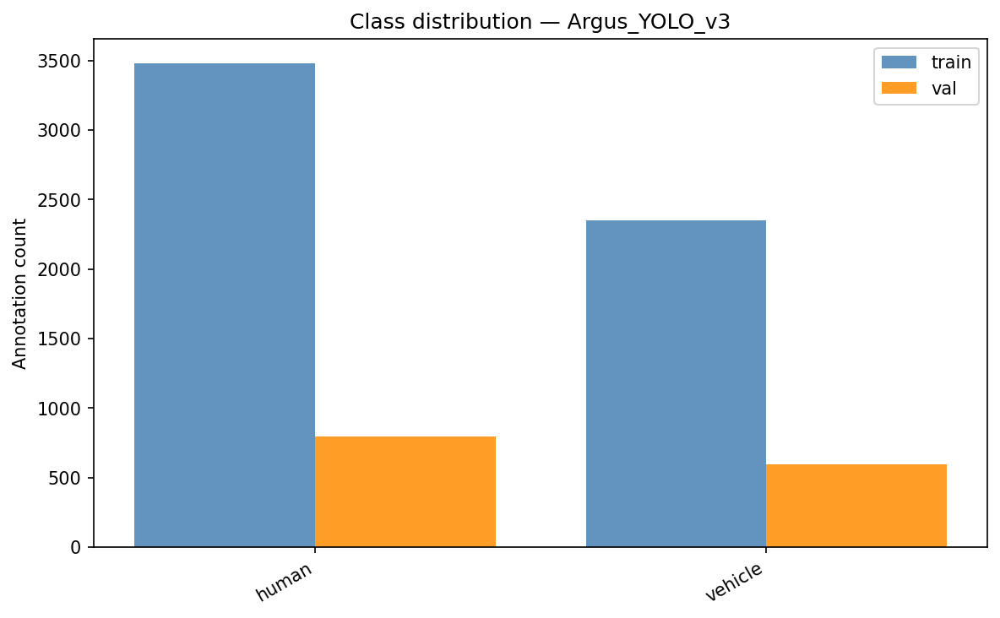
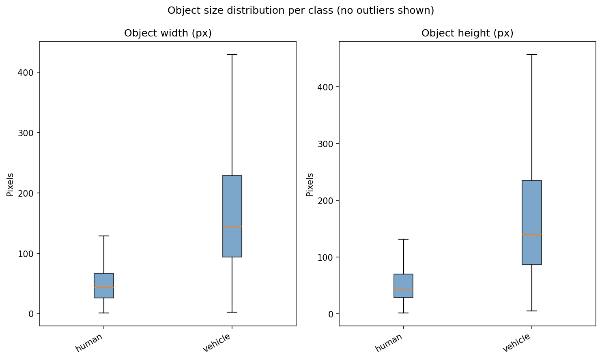

# ARGUS-YOLO — Human & Vehicle Detection from Nadir UAV Imagery

Three YOLO object detectors for detecting **humans** and **vehicles** (rescue forces, firefighters, emergency vehicles) in high-resolution **nadir** (top-down) UAV imagery of civil-protection and firefighting scenarios.

The models were developed for the [ARGUS WebApp](https://github.com/RoblabWh/argus) as part of the E-DRZ research project.

| File | Architecture | Params | Size |
|---|---|---:|---:|
| `argus_yolo11l_1280.pt` | YOLO11-L | 25.3 M | 49 MB |
| `argus_yolo11x_1280.pt` | YOLO11-X | 56.9 M | 109 MB |
| `argus_yolo26x_1280.pt` | YOLO26-X | 58.8 M | 113 MB |

**Classes:** `0: human`, `1: vehicle`

## Training

Each model was trained in two stages, starting from the official Ultralytics COCO-pretrained weights:

1. **VisDrone** — trained on the [VisDrone-DET](https://github.com/VisDrone/VisDrone-Dataset) dataset (large public UAV benchmark, ~8.6k images) at **960 px** input size. This establishes small-object detection capability on aerial imagery. VisDrone images are, however, mostly **oblique** views of urban traffic — not the target domain.
2. **ARGUS fine-tuning** — fine-tuned on our own ARGUS dataset at **1280 px** input size: high-resolution **nadir** UAV captures of real firefighting and rescue operations and exercises (publication of the dataset is pending).

## Intended Use & Inference

- **Domain:** nadir (top-down) UAV imagery of rescue / firefighting / civil-protection scenes
- **Flight altitude:** 20–100 m (as in the training data)
- **Image resolution:** high-resolution captures, ≥ 4000×3000 px (typical drone camera output)
- **Input size:** use **`imgsz=1280`** at inference — the models were fine-tuned and evaluated at this resolution; other sizes will degrade results

```python
from ultralytics import YOLO

model = YOLO("argus_yolo26x_1280.pt")  # or argus_yolo11l_1280.pt / argus_yolo11x_1280.pt
results = model.predict("uav_image.jpg", imgsz=1280, conf=0.25)
results[0].show()
```

> **Note:** YOLO26 requires a recent `ultralytics` version (≥ 8.4). YOLO11 models work with any version that includes YOLO11.

## Results

Evaluated on the ARGUS validation split (100 held-out images, 1389 annotations) with Ultralytics `.val()` at `imgsz=1280`, `conf=0.001`, `iou=0.6`, `batch=1` (single-image deployment conditions; inference time on an RTX 5080).

### Overall

| Model | Precision | Recall | mAP@0.5 | mAP@0.5:0.95 | VRAM (MB) | Time (ms) |
|---|---:|---:|---:|---:|---:|---:|
| argus_yolo11l_1280 | 0.828 | **0.812** | **0.869** | 0.605 | **466** | **13.0** |
| argus_yolo11x_1280 | 0.835 | 0.820 | 0.864 | **0.617** | 797 | 23.5 |
| argus_yolo26x_1280 | **0.875** | 0.778 | 0.868 | 0.610 | 792 | 23.9 |

### Per class

| Model              | Human Precision | Human Recall | Human mAP@0.5 | Vehicle Precision | Vehicle Recall | Vehicle mAP@0.5 |
| ------------------ | ---------: | ---------: | ---------: | ----------: | ---------: | ---------: |
| argus_yolo11l_1280 |           0.737 |        0.695 |         0.777 |             0.920 |          0.929 |           0.961 |
| argus_yolo11x_1280 |           0.731 |        0.704 |         0.757 |             0.939 |          0.936 |           0.970 |
| argus_yolo26x_1280 |           0.812 |        0.646 |         0.775 |             0.938 |          0.909 |           0.961 |


Humans are the harder class: at 20–100 m altitude a person covers only ~43×44 px (median) even in 4000×3000 px images, which is why the models were trained on high input resolutions.

## The ARGUS Dataset

The fine-tuning dataset consists of nadir UAV imagery from real firefighting/rescue operations and exercises in Germany (e.g. flood response in the Ahr valley 2021, fire exercises, DRZ integration sprints and oprations from the Bielefeld fire brigade). **Publication of the dataset is pending.**

| | Train | Val | Total |
|---|---:|---:|---:|
| Images | 323 | 100 | 423 |
| Annotations | 5 829 | 1 389 | 7 218 |
| — human | 3 480 (60 %) | 797 (57 %) | 4 277 |
| — vehicle | 2 349 (40 %) | 592 (43 %) | 2 941 |

- **Resolutions:** 2048×1534 up to 8000×6000 px; most common 4000×3000 (212 images) and 4056×3040 (113 images)
- **Median object size (native resolution):** human ≈ 43×44 px, vehicle ≈ 145×140 px

| Class distribution | Object sizes |
|---|---|
|  |  |

### Sample images

Sample of holdout validation split — predictions of `argus_yolo11x_1280` (`imgsz=1280`, `conf=0.25`, green boxes) vs. ground truth (red boxes):


## Limitations

- **Nadir bias.** Fine-tuning data is almost exclusively top-down; performance on strongly oblique views relies on the VisDrone stage and will be weaker.
- **Domain.** Trained on European (German) rescue and firefighting scenes; generalization to other environments is untested.
- **Resolution sensitivity.** Results were obtained at `imgsz=1280` on high-resolution inputs; low-resolution imagery or smaller inference sizes will reduce accuracy, especially for humans.

## License

The models are derived from Ultralytics YOLO11 / YOLO26 pretrained weights and are therefore released under **AGPL-3.0**, matching the [Ultralytics license](https://www.ultralytics.com/legal/agpl-3-0-software-license).